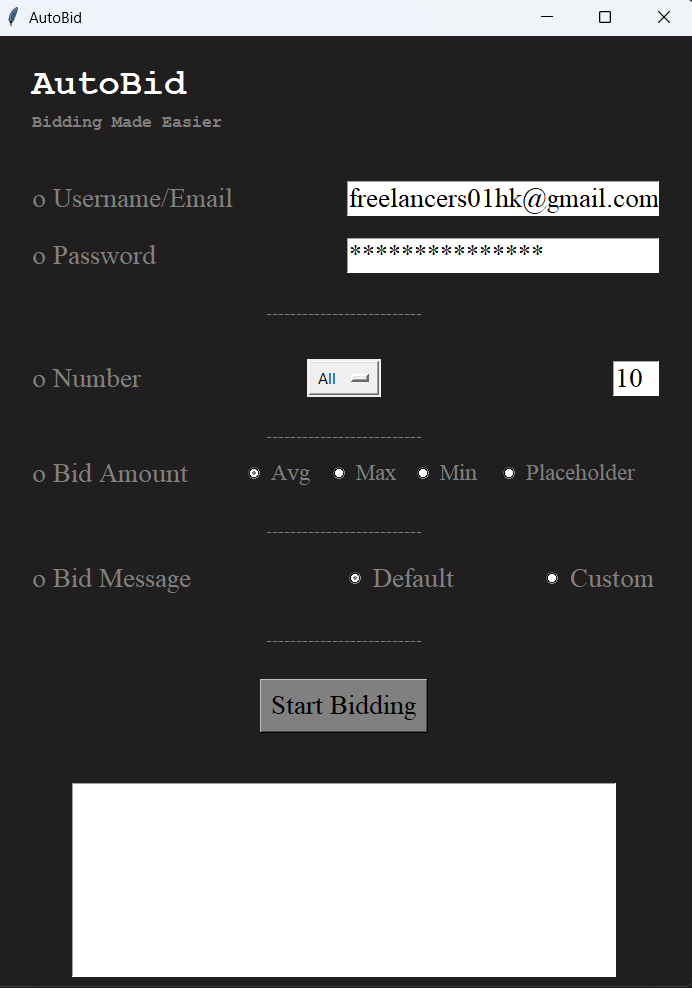

# Freelancer Bidding Automation

The **Freelancer Bidding Automation** tool is designed to simplify the process of bidding on projects on the Freelancer platform. This Python-based application uses the Selenium library to automate the bidding process, making it easier for freelancers to bid on multiple projects quickly.



## Features

- **Automated Bidding:** The tool automates the bidding process on the Freelancer platform, saving time and effort for freelancers.

- **Customizable Messages:** Freelancers can choose between default bidding messages or customize their own.

- **Bid Amount Options:** Choose to bid with average, minimum, or maximum project budgets.

- **Project Skill Filtering:** Filter projects based on specific skills or choose to bid on all available projects.

## Requirements

To use the Freelancer Bidding Automation tool, you'll need the following:

- **Python:** Make sure you have Python installed (version 3.x recommended).

- **Selenium:** Install the Selenium library using `pip install selenium`.

- **Chrome WebDriver:** Download the Chrome WebDriver from [here](https://sites.google.com/chromium.org/driver/). Update the `executable_path` in the code with the path to your Chrome WebDriver.

- **Beautiful Soup:** Install the BeautifulSoup library using `pip install beautifulsoup4`.

- **PyAutoGUI:** Install the PyAutoGUI library using `pip install pyautogui`.

## Usage

1. Run the application by executing the script:

   ```bash
   python main.py
   ```

2. Provide your Freelancer account details by entering your username/email and password.

3. Configure your bidding preferences:
   - Enter the number of projects you want to bid on.
   - Choose the project skill(s) you want to target or select "All" to bid on all available projects.
   - Select your bid amount type (average, minimum, maximum, or use a custom placeholder).
   - Choose between a default bidding message or create a custom message.

4. Click the "Start Bidding" button to begin the automated bidding process.

5. The tool will automatically log in to your Freelancer account, find and bid on projects based on your preferences.

6. The bidding process will be logged in the "logs.txt" file, which you can review for details.

## Customizing Messages

You can customize your bidding message by selecting the "Custom" option in the "Bid Message" section. The tool will use the message you provide. Ensure you have the desired message in the `bidMessage` variable in the code.

```python
bidMessage = """Enter your custom message here!"""
```

## Note

- Use this tool responsibly and ensure that you have the necessary permissions to automate actions on the Freelancer platform.

- Make sure to keep your login credentials secure.

- This tool may require adjustments if there are changes in the Freelancer platform's structure or policies.

## Author

This tool was developed by [Hammad Ali](https://github.com/hammadali1805).

